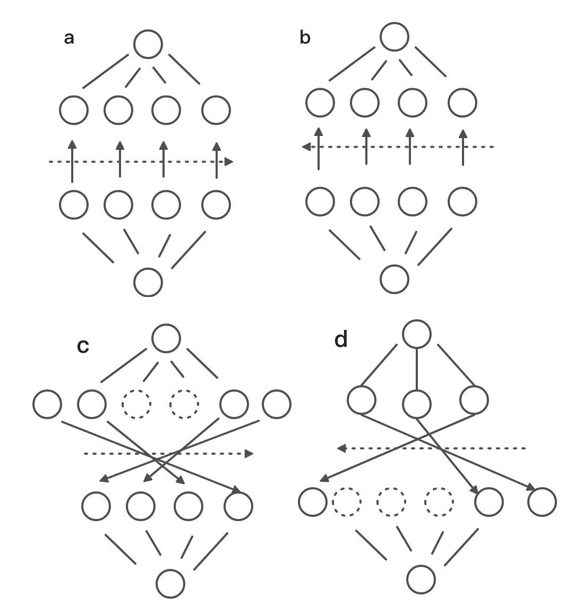
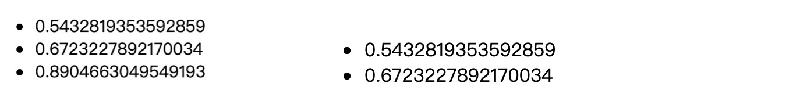

### 热更新原理

key 在对比 VNode 差异过程中起到重要作用，Vue 在比较 VNode 时执行的是一个叫 `sameNode` 的方法，
在这个方法中，通过比较两个节点的key ，tag, isComment 属性值，是否都有 data 属性，是否是同类型的input。对于异步组件，则判断 asyncFactory 是否相同。

```Javascript
function sameVnode (a, b) {
  return (
    a.key === b.key && (
      (
        a.tag === b.tag &&
        a.isComment === b.isComment &&
        isDef(a.data) === isDef(b.data) &&
        sameInputType(a, b)
      ) || (
        isTrue(a.isAsyncPlaceholder) &&
        a.asyncFactory === b.asyncFactory &&
        isUndef(b.asyncFactory.error)
      )
    )
  )
}
```

在解析这个问题之前，首先要知道在数据发生变化后， Vue 比较新旧 VNode 的 diff 算法：如果是相同的父节点，且新旧 VNode 的子节点都还在，会对其子节点进行比较，做到尽量复用旧的节点 。
  1. new VNode 有children, 而old VNode 没有，执行插入节点。
  2. new VNode 没有children, 而old VNode 有，执行删除节点。
  3. new VNode，old VNode 都有children, 执行 diff 算法。

      a. 旧首节点和新首节点用 sameNode 对比

      b. 旧尾节点和新尾节点用 sameNode 对比

      c. 旧首节点和新尾节点用 sameNode 对比

      d. 旧尾节点和新首节点用 sameNode 对比

      e. 如果以上逻辑都匹配不到，再把所有旧子节点的 key 做一个映射到旧节点下标的 key -> index 表，然后用新 vnode 的 key 去找出在旧节点中可以复用的位置。

执行节点判断的前提：`oldStartIdx <= oldEndIdx && newStartIdx <= newEndIdx`，即还没有遍历到中间节点时。

 

不停的把匹配到的指针向内部收缩，直到新旧节点有一端的指针相遇，有两种特殊情况。

* 有旧节点被删除。 新节点先 patch 完，于是 `newStartIdx > newEndIdx`  ，那么就会去删除多余的旧子节点。

* 有新节点加入。 旧节点先 patch 完，于是 `oldStartIdx > oldEndIdx`，但是有可能还有新的节点没有被处理到。接着会去判断是否要新增子节点。

以上便是 diff 的核心算法，接下来继续看题目的问题：
问题一：
当将index 作为 key，修改数据的顺序，但是key 的值不会发生改变，新的第一个节点会跟旧的第一个节点通过 `sameNode` 检测。

然后进入 `patchNode` 方法，对于<b>组件节点</b> `patchNode` 会去检查 props 有没有变更，如果有的话，会拿新的数据去更新这个响应式的值，触发 setter 的 `dep.notify`，然后触发子组件视图的重新渲染等一套很重的逻辑。

如果使用一个 id 作为 key, 在 diff 过程，新的 Vnode 就可以在旧的 VNode 中找到可以复用的 VNode。

问题二：
当删除一个节点，使用 index 作为key还会引起渲染错误。

```Javascript
<template>
  <ul>
    <li v-for="(d, index) in list" :key="index">
      <text></text>
    </li>
  </ul>
</template>

<script>
export default {
    data () {
    return {
        list: [1,2,3]
    }
  },
  components: {
    text: {
        template: `${Math.random()}`
    }
  }
}
</script>
```

数据改变：

```Javascript
[{
    tag: "li", key: 0 // 这里其实子组件对应的是第一个 假设子组件的text是1
  }, {
    tag: "li", key: 1 // 这里其实子组件对应的是第二个 假设子组件的text是2
  }, {
    tag: "li", key: 2 // 这里其实子组件对应的是第三个 假设子组件的text是3
}];
[{ // 第一个被删了
    tag: "li", key: 0, // 这里其实上一轮子组件对应的是第二个 假设子组件的text是2
  },{
    tag: "li", key: 1, // 这里其实子组件对应的是第三个 假设子组件的text是3
}];
```
 

这里删除第一个数据，本应该渲染第二、三个 li，但是在 `sameNode` 检测过程中，匹配上了原来的第一、二个li，造成渲染错误。

经过分析 diff 算法的分析和两个例子实践，平时在编写代码的时候，最好不要使用 index 作为 key