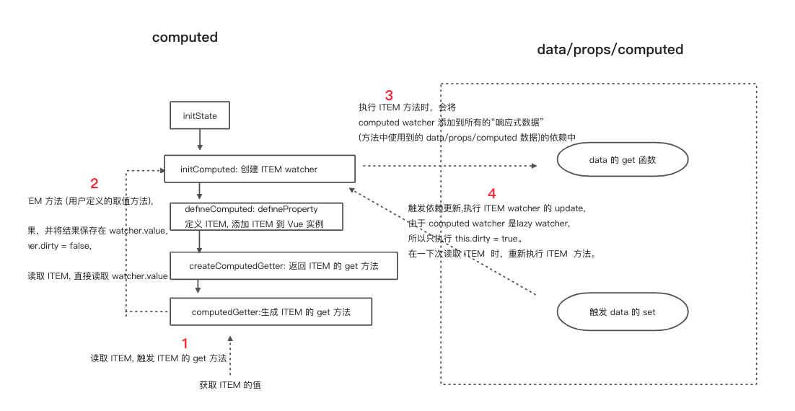

### Computed
初始化组件过程中，inState 方法中会执行 initComputed 收集 computed 属性中的方法(接下来我把每一个方法叫做 ITEM)，这些方法名以后是可以通过this (组件实例)访问到的。

initComputed 中会给 每个 ITEM 创建一个 Watcher，然后通过 Object.defineProperty 定义 ITEM 的 get 方法（在 createComputedGetter 方法定义的） 和 set 方法。 createComputedGetter 方法返回一个叫 computedGetter 的方法，这个方法里会调用 watcher 里的逻辑，也是实现 computed 最重要的一块。

```JS
function initState (vm: Component) {
  //...
  if (opts.computed) initComputed(vm, opts.computed)
  //...
}
```
```JS
function initComputed (vm: Component, computed: Object) {
  const watchers = vm._computedWatchers = Object.create(null)
  const isSSR = isServerRendering()

  for (const key in computed) {
    const userDef = computed[key]
    const getter = typeof userDef === 'function' ? userDef : userDef.get

    if (!isSSR) {
      // create internal watcher for the computed property.
      watchers[key] = new Watcher(
        vm,
        getter || noop,
        noop,
        computedWatcherOptions
      )
    }

    if (!(key in vm)) {
      defineComputed(vm, key, userDef)
    } else if (process.env.NODE_ENV !== 'production') {
      // error....
  }
}
```
```JS
export function defineComputed (
  target: any,
  key: string,
  userDef: Object | Function
) {
  const shouldCache = !isServerRendering()
  if (typeof userDef === 'function') {
    sharedPropertyDefinition.get = shouldCache
      ? createComputedGetter(key)
      : createGetterInvoker(userDef)

    sharedPropertyDefinition.set = noop
  } else {
    sharedPropertyDefinition.get = userDef.get
      ? shouldCache && userDef.cache !== false
        ? createComputedGetter(key)
        : createGetterInvoker(userDef.get)
      : noop
    sharedPropertyDefinition.set = userDef.set || noop
  }

  // ...
  Object.defineProperty(target, key, sharedPropertyDefinition)
}
```

```JS
function createComputedGetter (key) {
  return function computedGetter () {
    const watcher = this._computedWatchers && this._computedWatchers[key]
    if (watcher) {
      if (watcher.dirty) {
        watcher.evaluate()
      }
      if (Dep.target) {
        watcher.depend()
      }
      return watcher.value
    }
  }
}
```
要搞懂 ITEM 的 get 方法运行原理，最好先学习 Vue 的“依赖收集”的原理


#### computedGetter
`computedGetter`: 获取 ITEM 的 watcher，第一次读取 ITEM 的时候， `watcher.dirty` 为 true，所以执行 `watcher.evaluate`, 最后返回 ITEM 的结果。如果是多次读取，dirty 为 false 会直接返回 watcher.value

#### watcher.evaluate

watcher.evaluate: 执行 `watcher.dirty = false`, 执行 watcher 的 `get` 方法，打开依赖收集开关(`pushTarget(this)`)，ITEM 的方法（computed 中定义的方法）中被引用的响应式数据会将 ITEM 的 watcher 收集。最后返回 ITEM 方法的执行结果。computed 是有缓存的功能，稍后解释是如何实现的。
```js
  // Watcher 中的方法：
  evaluate () {
    this.value = this.get()
    this.dirty = false
  }

  get () {
    pushTarget(this)
    let value
    const vm = this.vm
    try {
      value = this.getter.call(vm, vm)
    } catch (e) {
      //...
    } finally {
      // ...
      popTarget()
      this.cleanupDeps()
    }
    return value
  }
```

当 ITEM 方法中的这些响应式数据被修改，会执行数据的 dep.notify，将执行该数据下的所有的 wacher 的 update 方法，ITEM 的 watcher 是 lazy watcher，所以执行 this.dirty = true；然后在读取 ITEM 的时候 再执行 watcher 的 get 函数（通过 watcher.evaluate执行的）


#### computed 缓存原理
当读取一次 ITEM 之后，watcher 的 get 函数会设置 dirty 为 false, ITEM 方法的执行结果会缓存在watcher.value, 所以之后读取 ITEM，会直接返回 value。当响应式数据发生改变，computed wathcer会设置 dirty 为 false, 再去读取ITEM 的时候，就会触发计算。
```js
  if (watcher.dirty) {
    watcher.evaluate()
  }
  // ...
  return watcher.value
```

```js
  update () {
    /* istanbul ignore else */
    if (this.lazy) {
      this.dirty = true
    } else if (this.sync) {
      this.run()
    } else {
      queueWatcher(this)
    }
  }
```

#### computed 的原理图：
实现箭头是 computed 的实现过程，虚线是读取 ITEM 的过程

 


### watch
每一个在 template 使用的数据，都会在依赖收集过程中会有一个视图 Watcher,
watche 相当于给响应式数据再添加一个 watcher，在数据发生改变，会执行这个 watcher。
```js
function initState (vm: Component) {
  //...
  if (opts.watch && opts.watch !== nativeWatch) {
    initWatch(vm, opts.watch)
  }
}
```
```js
function initWatch (vm: Component, watch: Object) {
  for (const key in watch) {
    const handler = watch[key]
    if (Array.isArray(handler)) {
      for (let i = 0; i < handler.length; i++) {
        createWatcher(vm, key, handler[i])
      }
    } else {
      createWatcher(vm, key, handler)
    }
  }
}

function createWatcher (
  vm: Component,
  expOrFn: string | Function,
  handler: any,
  options?: Object
) {
  if (isPlainObject(handler)) {
    options = handler
    handler = handler.handler
  }
  if (typeof handler === 'string') {
    handler = vm[handler]
  }
  return vm.$watch(expOrFn, handler, options)
}
```
#### initWatch
处理 handler 是数组的情况

#### createWatcher
处理 watch item 的属性值是方法名字符串、Object 对象的情况

#### vm.$watch
创建 watcher, 触发 watched item 的get 函数，将 watcher 作为依赖收集，下次触发 watched item的 set 函数，执行watcher 的cb


### computed 和 watch 区别：
* 创建的结果：computed 是创建一个新的响应式数据，watch 是当原有的响应式数据发生改变时执行回调

* 使用场景：computed 用于依赖单个或多个响应式数据变化而变化，watch 用于单个响应式数据变化而执行回调，可以说computed 是将多个 watch 合并

* 回调函数：computed 的回调是同步代码，watch 的回调可以是同步代码和异步代码

* 实现方案不同：computed：
   * computed 数据创建的是一个 lazy watcher，每次触发computed 数据的get 函数，只执行一次回调，
   * 只有当依赖数据发生变化时，才会触发重新计算。
   * watch:
         每次触发 watch 数据的get函数，就会执行一次回调