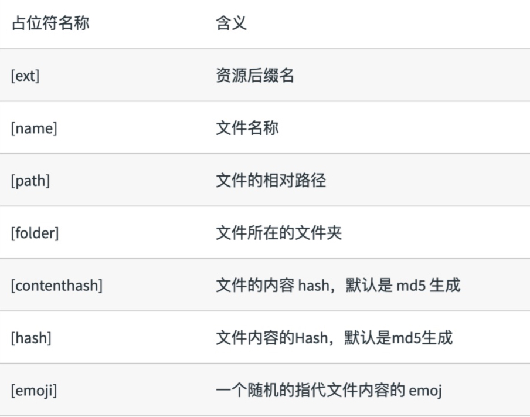

### 文件指纹

文件指纹: 打包输出的文件名的后缀，用于文件的版本管理
#### 指纹类别：
hash: 和整个项目的构建相关，只要项目文件有修改，整个项目构建的 hash 值就会更改
chunkhash: 和 webpack 打包的 chunk 有关，不同的 entry 会生成不同的 chunkhash 值
contenthash: 根据文件内容来定义hash, 文件内容不变，则 contenthash 不同。

#### 指纹的常用场景：
1. hash: 设置 file-loader 的 filename 使用 hash, 用于图片和字体等
2. 设置output js文件的 filename  使用 chunkhash
3. contenthash: CSS 文件的filename 使用 contenthash 需要配合 MiniCssExtractPlugin 使用，将CSS代码生成一个css文件

JS 文件： 设置 output 的 filename，使用 [chunkhash]
CSS 文件：设置 MiniCssExtractPlugin 的 filename， 使用 [contenthash]
图⽚文件： 设置 file-loader 的 name，使用 [hash]（文件内容的hash）

### 占位符含义（附加）
 

