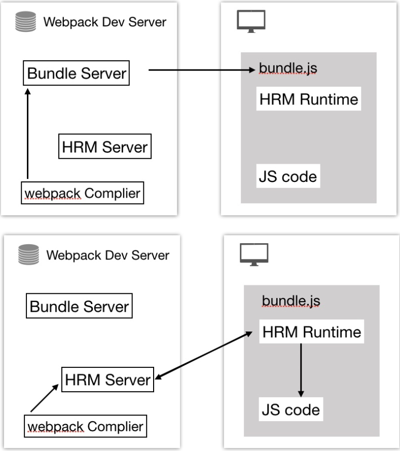

### 热更新原理
#### 几个重要的概念
* Webpack Compile: 编译Js代码成 Bundle (打包好的文件)
* Bundle server: 文件服务器，让浏览器以服务器方式的访问文件
* HMR Server: HMR Server 通知 HMR Runtime 代码更新
* HMR Rumtime: 在打包阶段会被注⼊到 bundle.js 文件，bundle.js 和服务器(HMR Server)建立 websocket 连接，监听⽂件变化
* bundle.js: 构建输出的⽂文件

 

#### 初次编译
Webpack Compile 将源代码编译成 bundle, 然后将打包好的代码传到 Bundle Server(服务器)，浏览器可以在 localhost 访问 Bundle Server 中的bundle.js

#### 更新代码
当再次修改文件，经过 Webpack Complier 编译更新的代码，HMR Server 再通知 HMR Runtime 代码更新了，
被更新代码会被以Json的形式传给 HMR Runtime，然后再在客户端执行更新的代码。