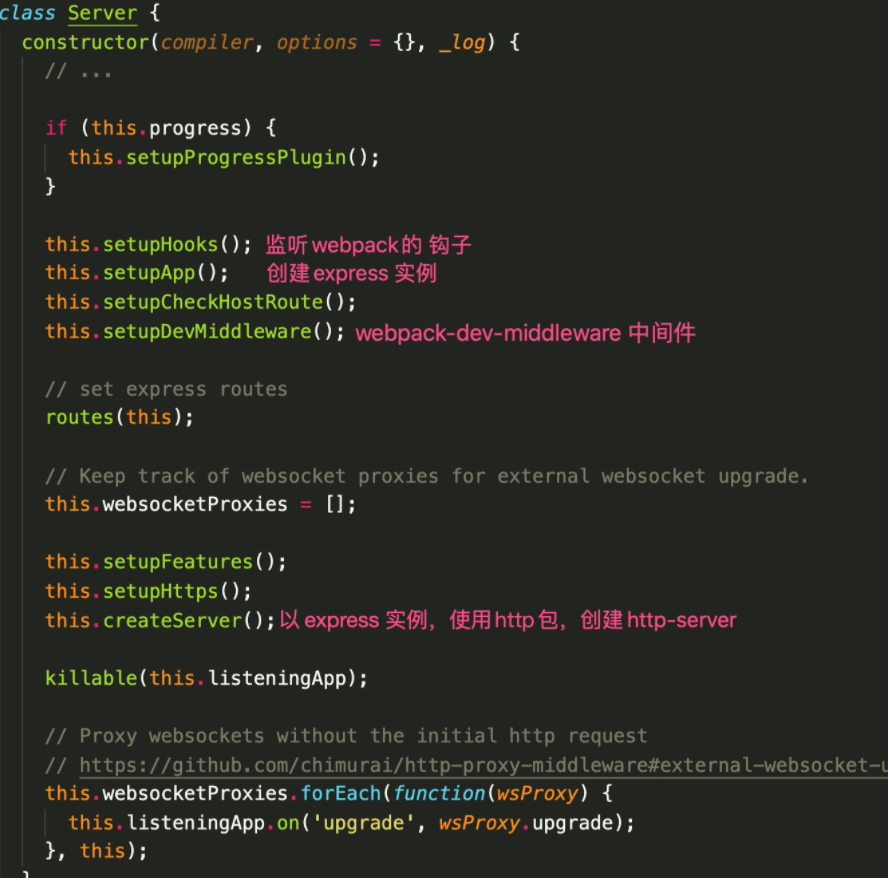

## webpack 热编译原理

一、热编译的方式

热编译的方式有三种：
  1. `watch` 模式
  2. `webpack-dev-server`(webpack-dev-middleware + express) + `hot-module-replacement-plugin`
  3. `webpack-dev-middleware` + `webpack-hot-middleware` + `hot-module-replacement-plugin`

使用 `watch` 模式启动 webpack 能监听文件的变更，并且自动打包。每次打包后的结果将会存储到本地硬盘中，而 IO 操作是非常耗资源时间的。它不能启动本地服务，所以不方便本地开发。

第二种方式，`webpack-dev-server` 插件内部使用了 `webpack-dev-middleware`，`express` 和 `sockjs`。`express` 提供本地服务， `sockjs` 提供本地和服务的 webSocket 通信。

第三种方式，使用了 `webpack-dev-middleware` 和 `webpack-hot-middleware`，`webpack-hot-middleware` 通过 `window.EventSocurce` 实现了服务端和客户端之间的通信。需要开发者自己配置本地服务功能。

后两者需要使用 `hot-module-replacement-plugin` 实现发布和订阅代码的更新。在 webpack 第一次打包的时候，除了代码本身之外，`hot-module-replacement-plugin` 会生成 HMR runtime 订阅服务代码。HMR runtime 订阅服务端的更新变化，触发 HMR runtime API拉取最新的资源模块。初次编译和更新如图所示。


`webpack-dev-server` 是把热编译需要的东西都封装好了，开箱即用。使用 `webpack-dev-middleware` 的话，还需要开发者自行启动本地服务，使用 `webpack-hot-middleware` 配置服务端和客户端之间的通信。下面我们来简单写一个通过 `webpack-dev-middleware` 来启动服务。

```
const express = require('express');
const webpack = require('webpack');
const webpackDevMiddleware = require('webpack-dev-middleware');

const app = express();
const config = require('./webpack_config_file.js');
const compiler = webpack(config);

// 告知 express 使用 webpack-dev-middleware，
// 以及将 webpack.config.js 配置文件作为基础配置。
app.use(
  webpackDevMiddleware(compiler, {
    publicPath: config.output.publicPath,
  })
);

app.listen(3000, function () {
  console.log('app listening on port 3000!\n');
});
```

`webpack-dev-middleware` 内部是通过 webpack 的 `compiler.watch` 监听文件变化，动态编译最新的代码。使用 `memory-fs` 对象将 webpack 编译后的文件存储到内存中，用户访问服务时，就将内存中对应的资源输出返回。
```
//使用 memory-fs 对象将 webpack 编译后的文件存储到内存
// ./webpack-dev-middleware/lib/fs.js

if (isConfiguredFs) { //  context.options.fs
  const { fs } = context.options;
  if (typeof fs.join !== 'function') // throw error...
  compiler.outputFileSystem = fs;
  fileSystem = fs;
} else if (isMemoryFs) { // 是否为 memory-fs 的实例
  fileSystem = compiler.outputFileSystem;
} else {
  fileSystem = new MemoryFileSystem(); // memory-fs
  compiler.outputFileSystem = fileSystem;
}
context.fs = fileSystem;
```

```
// webpack-dev-middleware 通过 webpack 的 watch 监听文件变化，动态编译最新的代码。
// ./webpack-dev-middleware/index.js

// start watching
if (!options.lazy) {
  context.watching = compiler.watch(options.watchOptions, (err) => {
    if (err) // throw error
  });
} else {
  // ...
}
```

二、webpack-dev-server的热编译过程

#### 启动
执行 `webpack-dev-server` 命令，运行 `webpack-dev-server/bin/webpack-dev-server.js` 文件，执行 `startDevServer` 方法，做了以下事情：

1. `startDevServer` 方法：创建 webpack 实例

2. 创建一个 `Server` 类：
    * 添加了一些 webpack 事件监听，其中一个很重要的事件 `done`，用于在 webpack 编译完成后向客户端发送 websocket 消息
    * 创建 express 实例 —— `this.app`
    * 添加 `webpack-dev-middleware` 中间件 (把 webpack 处理后的文件传递给一个服务器)
    * 使用 `express` 和 `http`，创建服务器并启动服务


3. 在浏览器端和服务端之间建立一个 websocket 长连接

#### 初次编译
Webpack 将源代码编译, 然后将打包好的代码传到服务器，浏览器可以通过 localhost 访问这些存在内存中的文件。浏览器除了获取我们编写的代码内容之外，还有一部分是通过 `webpack-dev-server` 注入的 HMR runtime 代码(用于 ws 通信的客户端代码 和 用于热更新的代码)，用作浏览器与 webpack 服务器通信和热更新。

#### 更新代码
1. 当再次修改文件，Webpack Complier 编译更新的代码,每次编译生成唯一的 hash 值，根据变化的内容生成两个补丁文件：
    * 以上一次编译的 hash 命名的 json 文件， json文件里包含本次编译的 hash 值和内容发生变化的 chunk 的 chunkId —— `[old-hash].hot-update.json`（包含new-hash、chunkId）
    * 以上一次编译的hash命名的 js 文件，发生变化的 chunk 的 js 文件 —— `[old-hash].hot-update.js`

2. 客户端接受服务端的 hash (最新 hash) 和 ok 消息，接收到 ok 后，检测是否支持热更新，如果支持，发射更新事件 (webpackHotUpdate)

3. 请求 json 文件

4. 浏览器端 hmr runtime 根据 json 文件 的 hash(old-hash) 和 chunkId 使用 ajax 拉取最新的更新模块 chunk

5. 局部热重载：`hotAddUpdateChunk`(动态的更新代码模块) ---> `hotUpdateDownloaded` --> `hotApply`(热重载)


## 四、总结两端的工作流程
### 服务端
1. 启动 `webpack-dev-server` 服务器
2. 创建 webpack 实例
3. 创建 `Server` 服务器
4. 添加 webpack 的 `done` 事件回调，编译完成向客户端发送消息
5. 创建 express 应用 `app`
6. 设置文件系统为内存文件系统
7. 添加 webpack-dev-middleware 中间件，设置文件系统为内存文件系统。中间件负责返回生成的文件
8. 启动 webpack 编译
9. 创建 http 服务器并启动服务
10. 每当有新的浏览器端连接服务器，在浏览器端就会和服务端之间建立一个 websocket 长连接

### 客户端
1. webpack-dev-server/client 端会监听到此 hash 消息

2. 客户端收到 `ok` 的消息后会执行 `reloadApp` 方法进行更新

3. 在 `check` 方法里会调用 `module.hot.check` 方法

4. HotModuleReplacement.runtime 请求 `Manifest`

5. 调用 `JsonpMainTemplate.runtime.hotDownloadUpdateChunk` 方法通过 JSONP 请求获取到最新的模块代码

7. 补丁JS取回来后会调用 `JsonpMainTemplate.runtime.js` 的 `webpackHotUpdate` 方法，然后会调用 `HotModuleReplacement.runtime.js` 的 `hotAddUpdateChunk` 方法动态更新模块代码

8. 然后调用 `hotApply` 方法进行热更新


感谢你的阅读，才疏学浅，若有错误，欢迎指出～

参考链接:
https://segmentfault.com/a/1190000020310371
https://juejin.cn/post/6844904008432222215#heading-7