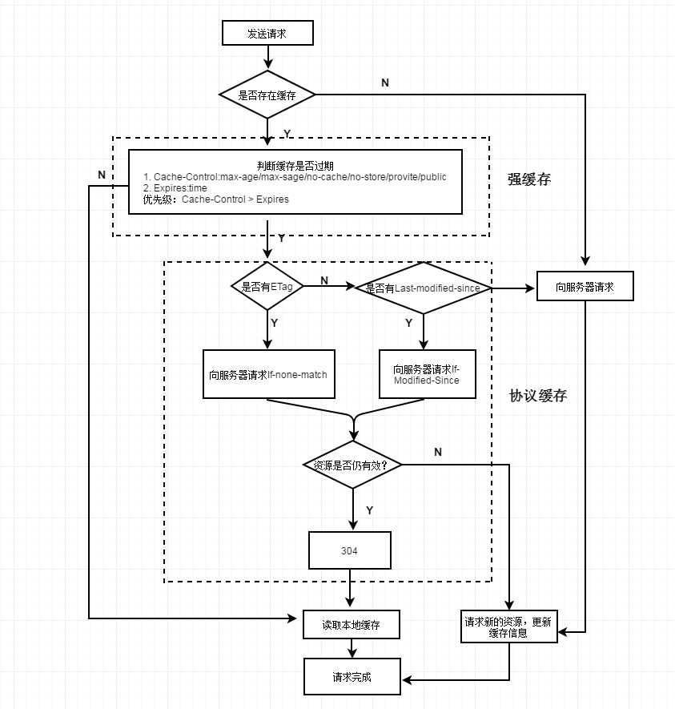

#### 缓存

##### Pragma  （HTTP/1.0）

Pragma 是 HTTP/1.0 标准中定义的一个header属性，请求中包含 Pragma 的效果跟在头信息中定义 Cache-Control: no-cache 相同，但是HTTP的响应头不支持这个属性，所以它不能拿来完全替代HTTP/1.1中定义的Cache-control头。通常定义Pragma以向后兼容基于HTTP/1.0的客户端。
```
<meta http-equiv="Pragma" content="no-cache">
```
注意：
1. 仅有IE才能识别这段meta标签含义，其它主流浏览器
        仅能识别“Cache-Control: no-store”的meta标签```<meta http-equiv="Cache-Control" content="no-cache">```。
2. <b>在IE中识别到该meta标签含义，并不一定会在请求字段加上Pragma</b>，但的确会让当前页面每次都发新请求（仅限页面，页面上的资源则不受影响）。

##### Expires  （HTTP/1.0）
Expires的值对应一个GMT（格林尼治时间），比如“Mon, 22 Jul 2002 11:12:01 GMT”来告诉浏览器资源缓存过期时间，如果还没过该时间点则不发请求。
在客户端我们同样可以使用meta标签来告诉IE（仅有IE能识别）页面（同样也只对页面有效，对页面上的资源无效）缓存时间：
  ```<meta http-equiv="expires" content="mon, 18 apr 2016 14:30:00 GMT">```

如果希望在IE下页面不走缓存，发新请求，那么可以把“content”里的值写为“-1”或“0”：
  ```<meta http-equiv="expires" content="-1">```
注意的是<b>该方式仅仅作为IE缓存时间的标记，你并不能在请求或响应报文中找到Expires字段。</b>
<b>Pragma的优先级高于Expirse</b>：如果Pragma禁用缓存，又给Expires定义一个还未到期的时间，刷新页面时发现均发起了新请求，这意味着Pragma字段的优先级会更高。

*现在 w3c 的规范字段中已经将在meta标签设置缓存机制的字段移除，写在meta标签中代表必须解析读取html的内容，但代理服务器是不会去读取的。大多浏览器已经不再支持，会忽略这样的写法，所以缓存还是通过HTTP headers去设置。且HTTP Headers中的缓存设置优先级比meta中http-equiv更高一些。

##### Cache-Control  （HTTP/1.1）

Cache-Control:no-store|no-cache|max-age| s-maxage

    no-store 禁止缓存对响应复制。
    
    no-cache 可以存储在本地，只是在与原始服务器进行新鲜度再验证之前，缓存不能将其提供给客服端响应首部。
    
    max-age 表示从服务器将文档传来之时起，可以认为此文档处于新鲜状态的秒数。
    
    s-maxage：与max-age 相似，只是它只适合公有缓存。 


http1.1新增了 Cache-Control来定义缓存过期时间，<b>Cache-Control优先级高于Expirse，Pragma</b>。

组合的形式还能做一些浏览器行为不一致的兼容处理。例如在IE我们可以使用 no-cache 来防止点击“后退”按钮时页面资源从缓存加载，但在 Firefox 中，需要使用 no-store 才能防止历史回退时浏览器不从缓存中去读取数据，故我们在响应报头加上如下组合值即可做兼容处理：<b>Cache-Control: no-cache, no-store（保证在所有浏览器中历史回退时浏览器不从缓存中去读取数据）</b>


#### 协商缓存
如果缓存过期了，我们就可以使用协商缓存来解决问题。协商缓存需要请求，如果缓存有效会返回 304。

##### Last-Modified 和 If-Modified-Since
---> If-Modified-Since 

<--- Last-Modified

Last-Modified 表示本地文件最后修改日期，If-Modified-Since 会将 Last-Modified 的值（之前response中Last-Modified）发送给服务器，询问服务器在该日期后资源是否有更新，有更新的话就会将新的资源发送回来。

但是如果在本地打开缓存文件，就会造成 Last-Modified 被修改，所以在 HTTP / 1.1 出现了 ETag 。

##### ETag 和 If-None-Match
---> If-None-Match 

<--- ETag          

ETag 类似于文件指纹，If-None-Match 会将当前 ETag （之前response中Etag）发送给服务器，询问该资源 ETag 是否变动，有变动的话就将新的资源发送回来。并且 **ETag 优先级比 Last-Modified 高**。

Etag主要为了解决 Last-Modified 无法解决的一些问题：
  * 文件也许会周期性的更改，但是他的内容并不改变，不希望客户端重新get；
  * 某些服务器不能精确的得到文件的最后修改时间。

  