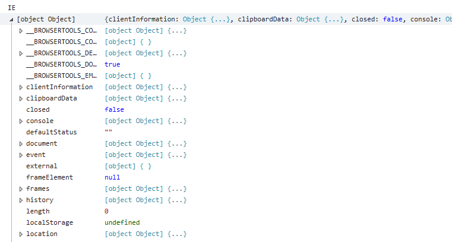

### 事件

#### 理解事件流
事件流描述的是从页面中接受事件的顺序。当浏览器发展到第四代时，IE 的事件流是冒泡，Netscape Communicator 的是捕获流。

冒泡即从事件目标沿DOM数向上直到document对象。
捕获即从document对象沿DOM数向上直到事件目标。

后来IE9+,Safari,Chrome,Opera 和 Firefox 都支持捕获和冒泡。就捕获的起点而言， “DOM2” 规定从 document 开始，但是这些浏览器都是从window对象开始捕获事件。由于老版本不支持捕获，很少人会使用事件捕获。

DOM事件流： 事件捕获阶段，处于目标阶段，事件冒泡阶段

DOM2级规定捕获阶段在触发目标的父级结束，下一阶段是处于目标阶段，于是事件在目标元素上发生，并在事件处理中被看成冒泡阶段的一部分，然后冒泡阶段发生。PS:“新版“浏览器都会在捕获阶段接触到.

#### DOM0级事件处理程序
 每个元素都有自己的事件处理程序属性，将这些属性的值设置为一个函数，就可以指定事件处理程序。

 例如onckick:
    let ele = document.getElementById("#ele");
    ele.onclick = function(){ //... };

DOM0 级方法指定的事件处理程序被认为是元素的方法，则这时的事件处理是在元素的作用域中运行，程序中的this 引用当前元素。
    ```
    let ele = document.getElementById("#ele");
    ele.onclick = function(){ 
        console.log(this.id); //ele
    };
    ```

删除 DOM0 级方法指定的事件处理程序： 
element.on[eventType] = null;
eg: ele.onclick = null

#### DOM2级事件处理程序

<b>IE9+,Safari,Chrome,Opera 和 Firefox 都支持捕获 DOM2 级事件处理程序。</b>

绑定事件：element.addEventListener(type, handler, useCapture)
移除事件：element.removeEventListener(type, handler, useCapture)

addEventListener,removeEventListener都接受三个参数，

type指的事件类型，
handler 指的事件处理程序，可以传入一个函数作为发生指定的事件类型的回调，
useCapture 接受一个布尔值，指的是否绑定在捕获阶段，false：绑定在冒泡阶段，true：绑定在捕获阶段。

使用 DOM2 级事件处理程序可以在同一元素上绑定多个同一类型的事件处理程序，执行顺序与绑定的顺序相同。
在DOM0 级不可以，后面绑定的程序会覆盖后面的。
```
	  <div id="app">
	  	<div id="child-1"></div>
	  </div>
```
```
	  	let child1 = document.querySelector("#child-1");

	  	child1.addEventListener('click', function(){
	  		console.log("DOM2 1");//DOM2 1
	  	},false)
	  	
	  	child1.addEventListener('click', function(){
	  		console.log("DOM2 2");//DOM2 2
	  	},false)
        
        //无效，被覆盖了
        child1.onclick = function(){
        console.log("DOM0 1")
        }

        child1.onclick = function(){
        console.log("DOM0 2"); //DOM0 2
        }
```

如果想使用 removeEventListener 接触绑定的事件处理程序，必须满足同元素同函数同阶段。即与绑定时使用的 addEventListener 里面的参数一模一样。
如果第二个参数是匿名函数，这样该事件处理程序就不能被解除了。


#### IE事件处理程序
*IE8-,Opera 支持捕获IE事件处理程序。

绑定事件：element.attachEvent(on[type], handler)
移除事件：element.detachEvent(on[type], handler)

IEDOM2接受两个参数，on[type]: on + 事件类型， handler: 事件处理程序，可以传入一个函数作为发生指定的事件类型的回调。（IE事件处理程序支持冒泡）

使用IE事件处理程序可以在同一元素上绑定多个同一类型的事件处理程序，但是它的执行顺序与绑定的顺序相反。

detachEvent用于解绑使用 attachEvent 绑定的事件处理程序。与DOM2级事件处理程序相同，attachEvent 和detachEvent参数需要一样才能解绑成功。
且如果第二个参数是匿名函数，这样该事件处理程序就不能被解除了。

还有一个需要注意的区别，使用IE事件处理程序时，事件处理程序会在全局作用域中运行，因此 this 等于window。DOM0 和DOM2 事件处理程序会在其所属的作用域执行。其回调函数中的this指向该元素。

``` 
    <div id="app">
	  	<div id="child-1"></div>
	</div>
```

```
    var child1 = document.getElementById("child-1");

    child1.attachEvent('onclick', function(){
        console.log("IE");
        console.log(this); 
    })
```


在DOM节点上触发一个事件时会产生一个事件对象，这个对象包含了事件类型，发生该事件的元素及其其他与事件相关的信息。例如，鼠标事件中，事件对象就会包含鼠标按键信息和鼠标位置等等，按键事件中，事件对象会包含与按下的键有关信息。所有的浏览器都支持这个对象，但是方式有所不同。

#### DOM 事件对象
兼容DOM事件的浏览器会把这个event对象传入事件处理程序中
```
<div id="app">
    <div id="child-1"></div>
</div>
```

```
var child1 = document.getElementById("child-1");

child1.addEventListener('click', function(event){
    console.log(event.type); // click
})

child1.onclick = function(event){
    console.log(event.type); // click
};
```

DOM事件对象中常用的属性和方法

属性/方法 | 类型 | 说明
---|---|---
type | String | 事件类型
cancelable | Boolean| 是否可以取消事件的默认行为
currentTarget | Element | 事件被绑定的 DOM 元素
target | Element | 事件触发的 DOM 元素
detail  |Integer | 发生鼠标事件时，返回一个表明鼠标按键的数字
preventDefault()| Function | 取消事件的默认行为，例如在按键事件中禁止输入内容
stopImmediatePropagation() | Function | 取消事件的进一步捕获或冒泡，同时阻止任何事件处理程序被调用
stopPropagation() | Function | 取消事件的进一步捕获或冒泡

#### IE中的事件对象
DOM0: event对象作为 window 对象的一个属性存在
DOM2: 使用 attachEvent()添加的事件处理程序会有一个 event 对象作为参数被传入回调函数中，也可以通过window.event获取。

```
var child1 = document.getElementById("child-1");

child1.attachEvent('onclick', function(event){
    console.log(event);
    console.log(window.event);
})

child1.onclick = function(){
    console.log(window.event); 
};
```

属性/方法 | 类型 | 说明
---|---|---
type | String | 事件类型
cancelBubble | Boolean | 是否取消事件冒泡（为 true 时与 stopPropagation() 作用相同），默认为 false。
returnValue | Boolean | 是否执行事件的默认行为（为 false 时与 preventDefault() 作用相同），默认为 true。
srcElement | Element | 事件触发的 DOM 元素(与 target 相同)