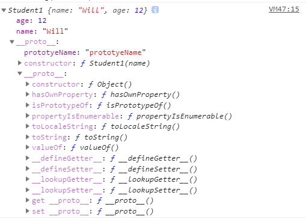

### Oject.create 原理和实现

Object.create，语法：```Object.create(target, ...source)```，用于将一个或者多个源对象的所有可枚举属性的值复制到目标对象，同时返回目标对象。

使用Object的时候需要几点需要注意：
1. 原生的Object.assign 是不可枚举的

2. 当只有一个参数的时候：
    + 参数是 null 和 undefined 时会报错。
    + 参数是一个对象，会直接返回。
    + 参数不是对象且不是 null 和 undefined ，则会先转成对象再返回。

3. 当有多个参数的时候，
    + 如果包含null，undefined，布尔值，数字，Symbol，这些参数会被忽略。
    + 如果有一个参数为字符串，则它后面的参数不能包含 ``` "0" ```这个参数。因为 Oject(string) 的 writable 为 false.
    ```
        var obj = Object('abc'); 

        Object.getOwnPropertyDescriptor(obj, '0');
        /* {
            value: "a", 
            writable: false, 
            enumerable: true, 
            configurable: false
        } */
        
    ``` 
    但是不是所有情况修改writable:false的属性会报错。
    var obj = Object('abc'); 
    obj[0] = "N";
    console.log(obj);// {0: "a", 1: "b", 2: "c"}

    在严格模式下会出现报错：
    ```
    "use strict"    
    var obj = Object('abc'); 
    obj[0] = "N";   // Uncaught TypeError: Cannot assign to read only property '0' of object '[object String]'
    console.log(obj);// "abc"
    ```

    所有在模拟实现的时候需要在严格模式下。

4. assign不会复制原型上的对象
```
function Student1(name){
	this.name = name;	
}
Student1.prototype.prototyeName =  "prototyeName";

function Student2(age){
	this.age = age;	
}
Student2.prototype.prototyeAge =  18;

var student1 = new Student1("Will"),
    student2 = new Student2(12);

Object.assign(student1, student2);
console.log(student1)
```



所以我们在模拟的时候，对于通过Object.create(null)创建的对象不能直接使用obj.hasOwnProperty()来判断一个属性属不属于原型，hasOwnProperty方法来自于Object.prototype。
这种对象没有原型，只是一个纯对象，自然也没有办法拿到hasOwnProperty方法。

5. 模拟实习不需要支持Symbol，因为不支持Object.assign()的浏览器，自然也不支持Symbol。
