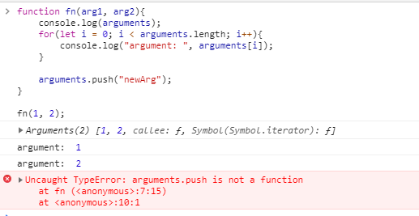

### call, apply的应用场景和模拟实现
call() 方法调用一个函数, 其具有一个指定的this值和分别地提供的参数(参数的列表)。

call() 方法的作用和 apply() 方法类似，只有一个区别，就是 call() 方法接受的是若干个参数的列表，而 apply() 方法接受的是一个包含多个参数的数组。

```
fn.call(ccontext, arg1, arg2, arg3...);
fn.apply(ccontext, [arg1, arg2, arg3...]);
```

#### 应用场景

1. 判断数据类型
对于数据类型判断我们可以使用typeof 运算符, 但是它有一个bug， 对于 Object 和 null， typeof 都会返回 "object"。还有正则对象和日期对象，typeof 都是返回的 "object", 这个判断结果就有点不精确。

通过调用Object.prototype上的toString方法，所有数据类型（包括不同类型的对象）都可以被正确的判断。
```
function typeChecker(data){
    //往Object.prototype.toString.call()传入一个参数返回类型这样的字符串[object String],
    //后面部分的字符代表参数的数据类型。为了方便使用，我们就把后面部分字符截取出来。
    return Object.prototype.toString.call(data).slice(8, -1);
}

typeChecker("str");    // "String"

typeChecker(null);     // "Null"

typeChecker({});       // "Object"

typeChecker(/a/);      // "RegExp"
typeof /a/;            // "object"

typeChecker(new Date); // "Date"
typeof new Date        // "object"
```

2. 类数组对象转换为数组
类数组对象是一个对象。比如 arguments 对象，还有DOM API 返回的 NodeList 对象。类数组对象可以像数组一样使用循环得到每一项，可以获取它的length属性，但是不能使用 push/pop/shift/unshift 等数组方法。使用 Array.prototype.slice.call 可以将其转换成真正的数组后，就可以使用 Array下所有方法。
```
function fn(arg1, arg2){
    console.log(arguments);
    for(let i = 0; i < arguments.length; i++){
        console.log("argument: ", arguments[i]);
    }

    arguments.push("newArg");
}

fn(1, 2);
```



我们来对arguments转换后，得到的新的数组就可以调用 Array.prototype 上的方法了：
```
function fn(arg1, arg2){    
    let newArgs = Array.prototype.slice.call(arguments);
    newArgs.push("newArg");
   console.log(newArgs); // [1, 2, "newArg"]
}

fn(1, 2);
```
通过MDN上 对的Ployfill我们可以了解它将Array-like 对象转为真正的数组的原理

```
Array.prototype.slice = function(begin, end) {
    // IE < 9 gets unhappy with an undefined end argument
    end = (typeof end !== 'undefined') ? end : this.length;

    // For native Array objects, we use the native slice function
    if (Object.prototype.toString.call(this) === '[object Array]'){
    return _slice.call(this, begin, end); 
    }

    // For array like object we handle it ourselves.
    var i, cloned = [],
    size, len = this.length;

    // Handle negative value for "begin"
    var start = begin || 0;
    start = (start >= 0) ? start : Math.max(0, len + start);

    // Handle negative value for "end"
    var upTo = (typeof end == 'number') ? Math.min(end, len) : len;
    if (end < 0) {
    upTo = len + end;
    }

    // Actual expected size of the slice
    size = upTo - start;

    if (size > 0) {
    cloned = new Array(size);
    if (this.charAt) {
        for (i = 0; i < size; i++) {
        cloned[i] = this.charAt(start + i);
        }
    } else {
        for (i = 0; i < size; i++) {
        cloned[i] = this[start + i];
        }
    }
    }

    return cloned;
};
```
也可以使用 ES6 新增方法 Array.from()，它可以将类数组对象和可遍历（iterable）对象转为真正的数组。

3. 获取数组最大值和最小值
获取最大值和最小值，我们可能首先想到了Math.max和Math.min
Math.max(6,12,3,1); // 12
Math.min(6,12,3,1); // 1

但是他们需要传入一个参数列表，对于比较多个值的时候就不太方便。我们通常是把值保存在数组中要想对数组中的值进行比较就需要apply上场了。

Math.max.apply(null, [6,12,3,1]); // 12
Math.min.apply(null, [6,12,3,1]); // 1


4. 继承

在子构造函数中，通过调用父构造函数的call方法来实现继承

```
   function Parent(){
        this.name=["CSS","JS"];
    }

    Parent.prototype.sayName=function(){
		console.log(this.name);
	}

	function Child(){ 
      Parent.call(this);
    }

    var oChild=new Child();
    oChild.sayName(); 
    //COMMENT 1:
    //Uncaught TypeError: oChild.sayName is not a function
    //COMMENT 2:
    oChild2.hasOwnProperty("name"); // true
```

这个集成方式有两个缺点：

缺点：

1. 只能继承父类的实例属性和方法，不能继承父类的原型的属性/方法.(COMMENT 1)
2. 每个子类都会从父类那儿得到父类的实例函数的副本，性能不佳。(COMMENT 2)


#### 模拟实现call
1. fn.call();
2. fn.call(context);
3. fn.call(contex,arg1, arg2, arg3);
4. fn.call(null,arg1, arg2, arg3);
```
Function.prototype._call = function(context){
    var result = null;
    context = !!context ? context : window;    
    context.fn = this;

    if(arguments.length > 1){
        var args = [];
        for(var i = 1, len = arguments.length; i < len; i++){
            args.push(arguments[i]);
        }
        result = eval('context.fn('+ args.join(",") + ')');
    }else{
        result = eval('context.fn('+ args.join(",") + ')');
    }
    
    delete context.fn;
    return result;
}
```

#### 模拟实现apply
1. fn.apply();
2. fn.apply(context);
3. fn.apply(contex,[arg1, arg2, arg3]);
4. fn.apply(null,[arg1, arg2, arg3]);

```
Function.prototype._apply = function(context, arr){
    var result = null;

    context = !!context ? context : window;
    context.fn = this;

    if(Array.isArray(arr)){
        var args = [];
        for(var i =0, len = arr.length; i < len; i++){
            args.push(arr[i]);            
        }
        result = eval('context.fn('+ args.join(",") + ')');
    }else{
        result = context.fn();
    }
    
    delete context.fn;
    return result;
}
```

 