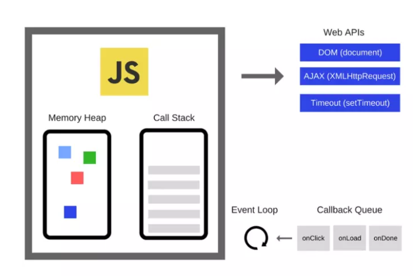

#### 定时器

在讲定时器之前简单介绍一下 JavaScript 的事件循环机制。JavaScript 是单线程的，为了定时器，Ajax 请求这些异步操作不阻塞代码执行，是 Call Stack (主线程)，Event Loop (事件循环)，Callback Queue (任务队列) 结合工作的。

1. 代码执行开始，全局执行上下文入栈，执行函数，函数上下文入栈。在遇到定时器，Ajax 请求等异步操作，会把它们交给对应的 WebAPI，接着执行同步任务。执行到 Stack 为空。
2. 在这期间, WebAPI 完成了对应的事件，会把异步任务的回调函数推入 Callback Queue 中等待。
3. 在执行栈为空时，Event Loop 会把 Callback Queue 中的一个任务放入 Call Stack 中，从第一步开始循环。

```
setTimeout， setInterval 都可以接受三种参数语法：
setTimeout/setInterval(code[, delay]); 
setTimeout/setInterval(function[, delay]); 
setTimeout/setInterval(function[, delay, param1, param2..]); 
```
* 第一个参数可以是一个在 delay 毫秒之后编译和执行的字符串，第二个参数是一个代表毫秒数的数字
* 第一个参数可以是一个每隔 delay 毫秒之后执行的回调函数,这时可以在第二个参数后面接一个参数列表，一次传入给回调函数。


我们一起探讨关于 setInterval，setTimeout 的回调执行时机。

> #### setInterval
##### setInterval 中回调函数的执行间隔时间
setInterval 指定的是回调函数“开始执行”之间的间隔，并不会在每次回调任务执行结束后才开始下一次任务的计时。（这里我们讨论的是第一轮 Call Stack中已经结束了的计时。）
因此，两次执行之间的间隔（指定时间-执行时间）会小于指定的时间。如果回调函数执行时间大于设置时间，回调执行一完成就马上进入下一个回调的执行，这样后面逐渐有越来越多的回调累加。

原理： 每隔设定的时间，处理 setInterval 的 WebAPI 将回调任务推入到 Callback Queue 中，然后等待 Call Stack 中的任务执行结束，Event Loop 监测到后再从 Callback Queue 中排在第一位的回调推到Call Stack 中。setInterval 不断的工作，不断的有回调推入到Callback Queue 中，如果回调在Call Stack 中的执行时间小于设置的延时，那么执行间隔时间 = 指定时间-执行时间。 如果大于 callback 添加到 callback Queue 的频率，所以有越来越多的回调累加。

比如，setInterval 指定每 100ms 执行一次，每次执行需要 5ms，那么第一次执行结束后95毫秒，第二次执行就会开始。如果某次执行耗时特别长，比如需要105毫秒，那么它结束后，下一次执行就会立即开始。然后会有越来越多的任务堆积在事件队列中。下面我们就用代码来解释这两种情况。

* 执行间隔时间 = 指定时间-执行时间
```
function sleep(ms) {
  var start = Date.now();
  while ((Date.now() - start) < ms) {
  }
}
```
```
setInterval(function(){
	console.count(); 
	sleep(1000)
	console.log("finish waiting"); 

}, 2000);	
// 由于在回调中，执行 sleep 耗时了1000 ms，所以打印了 "finish waiting" 之后，会在 1000ms 就会打印 console.count 的计数。
```
* 执行时间 > 指定时间
```
setInterval(function(){
	console.count(); 
	sleep(2001)
	console.log("finish waiting"); 

}, 2000);	
// 从第一个计时器开始，打印了	"finish waiting" 就会马上进入下一个执行,打印 console.count() 的计数，
```


为了确保两次执行之间有固定的间隔，可以使用 setTimeout 代替 setInterval。
```
function _setInterval(fn, ms){
	var timer = setTimeout(function f() {
	  fn();
	  if(timer)clearTimeout(timer)
	  timer = setTimeout(f, ms);
	}, ms);	 
}
```

##### setInterval 的开始执行时间

setInterval 的开始执行时间：设置时间 - 同步任务执行时间。

setInterval 回调任务的第一次执行要等到本轮事件循环的所有同步任务都执行完，才会开始执行。 如果同步任务执行时间大于setInterval设置时间，setInterval 的回调会等待同步任务的执行结束，且暂停计时。此时，即使同步任务时间很长， setInterval 也不会开始计时，回调函数也不会执行。等同步任务执行结束，恢复计时，马上执行回调。 后来就会按正常执行，（设置时间 - 回调函数执行时间） 后执行回调。

原理： 
第一轮 Call Stack 中执行的同步任务还没有结束，在此期间 setInterval 的设置的时间已到，回调任务就会被推入到 Callback Queue 中，setInterval 会暂停计时。
callback Queue 在 Call Stack 同步任务完成之前只会有一个也是第一个setInterval 的回调任务。
Event Loop 监测到第一轮 Call Stack 中的同步任务结束，setInterval 的第一个回调任务推入到 Call Stack，setInterval 继续计时。

* 开始执行时间 = 设置时间 - 同步任务执行时间
```
setInterval(function () {
	console.timeEnd("interval");
  console.count(); 
}, 3000);

sleep(2000);
console.time("interval");

//同步任务 sleep 中耗时 2000 ms。 所以第一个回调会在 1000 ms 之后就会运行。
```
* 设置时间 < 同步任务执行时间
```
console.log("start");
setInterval(function () {
  console.count(); 
}, 2000);

sleep(4000);
console.log("weka")
//生效后setInterval不会产生累积效应，即不会一下子输出两个 console.count 的计数，而是只会输出一个。	

```

> #### setTimeout
setTimeout 指的超时执行，所以我们只用讨论它的“开始执行时间”。 setTimeout 的执行时机和 setInterval 的类似。 如果开始执行时间 = 设定时间 - 同步任务的时间。 如果同步任务的时间大于设定时间，就在同步任务执行完之后马上执行回调。

原理：在Call Stack处理同步任务期间，setTimeout WebAPI 也在计时，如果同步任务的执行时间小于超时时间，Call Stack 就会有一段时间是空闲的，等到了超时时间，回调任务被推入 Callback Queue中，Event Loop监测到 Call Stack 为空，且Callback Queue 中有任务，就将回调任务推入 Call Stack 中。 
如果同步任务的执行时间大于超时时间，Call Stack 中还在执行同步任务的时候，回调任务就被推入到了 Callback Queue 中，Event Loop 一监测到 Call Stack 为空了，回调任务就被推入在 Call Stack 中了。

* 开始执行时间 = 设置时间 - 同步任务执行时间
```
console.log("start");
setTimeout(function(){
	console.timeEnd("Timeout")	
}, 3000);

sleep(1000);
console.log("over");
console.time("Timeout");
// 同步任务中的 sleep 耗时 3000ms, setTimeout 的设定时间为 1000 ms， 所以在2000ms左右， 回调就会被执行。
```
* 设置时间 < 同步任务执行时间
```
console.log("start");
setTimeout(function(){
	console.timeEnd("Timeout")	
}, 1000);

sleep(3000);
console.log("over");
console.time("Timeout");
// 同步任务中的 sleep 耗时 3000ms, 大于 seTimeout 设定的时间，所以同步任务一结束，setTimeout 的回调就马上执行了。
```

> #### setTimeout(f, x)

setTimeout(fn, x) 表示延迟x毫秒之后执行fn。，但是一般并不能保证立刻就执行 f，要看主线程的 Js 执行情况，延迟的时间严格来说总是大于设置的毫秒。

setTimeout(fn, 0) 表示主线程代码执行完成之后就 0 延时执行 fn。
HTML5 规范规定最小延迟时间不能小于4ms，即如果小于 4，会被当做 4 来处理。 不过不同浏览器的实现不一样，比如，Chrome可以设置 1ms，IE11/Edge 是 4ms。

定时器的运行原理就解析结束了。

