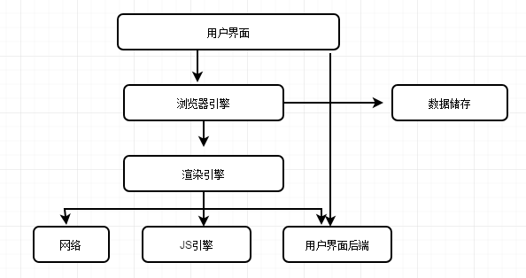
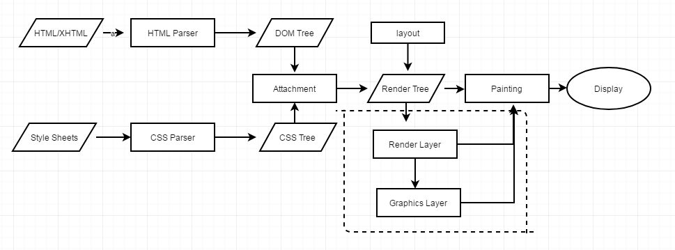
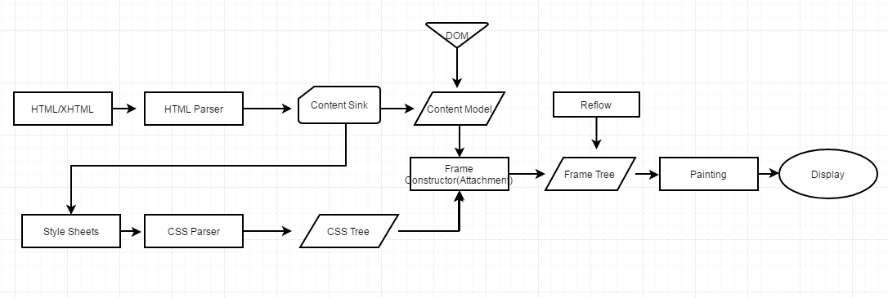
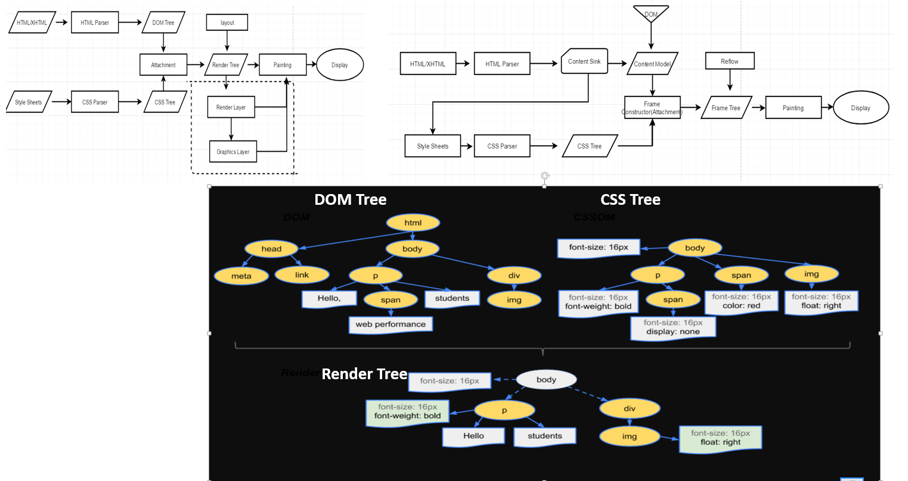

#### 浏览器的主要组件：

组件 | 说明
---|---
用户界面 | 地址栏、前进/后退按钮、书签菜单
浏览器引擎 |（在用户界面和呈现引擎之间传送指令）
渲染引擎 | Firefox: Gecko, Safari/Chrome: Webkit.
JS引擎 | 解析和执行 JavaScript 代码
数据存储 | 持久层，localStorage，cookie
网络 | 网络调用，比如 HTTP 请求
用户界面后端 | 绘制基本的窗口小部件，比如 alert，confirm 弹窗




#### 浏览器渲染引擎工作的大致过程：
Webkit浏览器


Gecko浏览器:


WebKit 和 Gecko 使用的术语略有不同，但整体流程是基本相同的。

* Gecko 将视觉格式化元素组成的树称为 “Frame Constructor（框架树）”，每个元素都是一个框架。WebKit 使用的术语是“Render Tree（呈现树）”，它由“呈现对象”组成。

* 对于元素的放置，WebKit 使用的术语是“layout（布局）”，而 Gecko 称之为“layout（重排）”。

* 对于连接 DOM Tree 和 CSSOS Tree 从而创建呈现树的过程，WebKit 使用的术语是“Attachment（附加）”。

* 有一个细微的非语义差别，就是 Gecko 在 HTML 与 DOM 树之间还有一个称为“Content Sink(内容槽)”的层，用于生成 DOM 元素。

##### 1. DOM树构建

* HTML字节数据编码成字符串；
* 将字符串转换成令牌， 标签中的字符串和属性等都会被转化成令牌每个令牌都有各自的特殊含义和一组规则，令牌记录了标签的开始与结束，通过这个特性可以轻松判断一个标签是否为子标签，<html> 标签的令牌还没有遇到结束令牌 </html> 就遇到<body>标签令牌，那么body就是html的子标签
* 令牌转换成定义其属性和规则的对象——节点对象
* 一系列的节点对象生成 DOM 树

大概流程： 字节 ---> 令牌 ---> 节点对象 ---> DOM树

构建DOM的过程中，不是等所有Token都转换完成后再去生成节点对象，而是每个开始标签标识的被生成后，会立刻消耗这个Token创建出节点对象。


##### 2. 构建 CSSOM 树

构建CSSOM的过程与构建DOM的过程非常相似，当浏览器接收到一段 CSS，浏览器首先要做的是识别出 Token，然后构建节点并生成 CSSOM。

大概流程： 字节 ---> 令牌 ---> 节点对象 ---> CSSOM

浏览器会确定下每一个节点的样式到底是什么，并且这一过程其实是很消耗资源的。一个元素有浏览的默认样式，页面作者定义的样式，一些元素还可以继承父元素的样式。某个样式属性的声明可能会出现在多个样式表中，也可能在同一个样式表中出现多次。

在这一过程中，浏览器得递归 CSSOM 树，然后确定具体的元素到底是什么样式。

根据 CSS2 规范，层叠的顺序为（优先级从低到高）：
浏览器声明 --> 用户普通声明 --> 作者普通声明 --> 作者重要声明 --> 用户重要声明

##### 3. 构建 Render Tree

DOM 和 CSSOM相结合构成Render树


##### 4. 布局
    布局流程的输出是一个“盒模型”，它会从渲染树的根节点开始遍历，精确地捕获每个元素在视口内的确切位置和尺寸，所有相对测量值都将转换为屏幕上的绝对像素。

    布局完成后，浏览器会立即发出“Paint Setup”和“Paint”事件，将渲染树转换成屏幕上的像素。

##### 5， 绘制


#### 常见引起回流属性和方法

任何会改变元素几何信息(元素的位置和尺寸大小)的操作，都会触发回流，

* 添加或者删除可见的DOM元素；
* 元素尺寸改变——边距、填充、边框、宽度和高度
* 内容变化，比如用户在input框中输入文字
* 浏览器窗口尺寸改变——resize事件发生时
* 计算 offsetWidth 和 offsetHeight 属性
* 设置 style 属性的值

#### 如何减少回流、重绘

* 使用 transform 替代 top （GPU加速）
* 使用 visibility 替换 display: none ，因为前者只会引起重绘，后者会引发回流（改变了布局）
* 不要把节点的属性值放在一个循环里当成循环里的变量。
* 使用documentFragment
* 不要使用 table 布局，可能很小的一个小改动会造成整个 table 的重新布局
* 动画实现的速度的选择，动画速度越快，回流次数越多，也可以选择使用 requestAnimationFrame
* CSS 选择符从右往左匹配查找，避免节点层级过多
* 将频繁重绘或者回流的节点设置为图层，图层能够阻止该节点的渲染行为影响别的节点。比如对于 video 标签来说，浏览器会自动将该节点变为图层。

#### 为什么操作 DOM 慢

因为 DOM 是属于渲染引擎中的东西，而 JS 又是 JS 引擎中的东西。当我们通过 JS 操作 DOM 的时候，其实这个操作涉及到了两个线程之间的通信，那么势必会带来一些性能上的损耗。操作 DOM 次数一多，也就等同于一直在进行线程之间的通信，并且操作 DOM 可能还会带来重绘回流的情况，所以也就导致了性能上的问题。

#### 解析文档时处理脚本和样式表的顺序
    * 脚本的加载和执行
        解析器遇到```<script>``` 标记时立即解析并执行脚本，文档的解析将停止，直到脚本执行完毕。
        如果脚本是外部的，那么解析过程会停止，直到从网络同步抓取资源完成后再继续执行脚本，脚本执行完毕后再继续解析。
        外部脚本有两个属性可以支持脚本不阻塞页面的解析：async，defer
        async: 异步加载，当资源返回后马上执行脚本。可能在DOMContentLoaded事件之前,如果有多个async的脚本，哪个先返回就先被执行。
        defer：延时执行，如果在页面完成解析之前返回，当页面解析完成后马上执行，即在DOMContentLoaded事件之后执行，
                如果在页面完成解析之后返回，则马上执行。如果有多个defer的脚本，按照顺序执行。
        

    * 页面资源的预解析：
        在执行脚本时，其他线程会解析文档的其余部分，找出并<b>加载需要通过网络加载的其他资源</b>，通过并行加载来提升呈现页面的速度。
        预解析器不会修改 DOM 树，而是将这项工作交由主解析器处理；预解析器只会解析外部资源（例如外部脚本、样式表和图片）的引用。

    * 样式表可能会影响页面的解析和 JS 的执行：
        理论上来说，应用样式表不会更改 DOM 树，似乎没有必要等待样式表而停止文档解析。但是有可能会在JS代码中获取或者修改CSS样式。
        脚本的加载完成可能会在CSSOM之前，也可能在之后，如果在CSSOM形成之前去获取样式，结果可能会有偏差。所以文档中含有脚本的时候，在CSSOM构建好之前，浏览器会延迟脚本的执行和DOM的构造。

        Firefox 在样式表加载和解析的过程中，会禁止所有脚本。而对于 WebKit 而言，仅当脚本尝试访问的样式属性可能受尚未加载的样式表影响时，它才会禁止该脚本。


#### Render 树和 DOM 树的关系

    在 DOM 树构建的同时，浏览器还会构建另一个树结构：Render 树。这是由可视化元素按照其显示顺序而组成的树，也是文档的可视化表示。它的作用是让您按照正确的顺序绘制内容。

    Firefox 将 Render 树中的元素称为“框架”。WebKit 使用的术语是呈现器或呈现对象。呈现器知道如何布局并将自身及其子元素绘制出来。 

    1. Render 树和 DOM 树的关系
        * 呈现 器是和 DOM 元素相对应的，但并非一一对应。非可视化的 DOM 元素不会插入 Render 树中，例如 ```head``` 元素。如果 ```display: none``` 的元素，那么也不会显示在Render 树中（但是 ```visibility: hidden```的元素仍会显示）。
    2. 样式计算
        构建Render 树时，需要计算每一个呈现对象的可视化属性。这是通过计算每个元素的样式属性来完成的。

        样式包括来自各种来源的样式表、inline 样式元素和 HTML 中的可视化属性（例如“bgcolor”属性）。其中后者将经过转化以匹配 CSS 样式属性。

        样式表的来源包括浏览器的默认样式表、由网页作者提供的样式表以及由浏览器用户提供的用户样式表


