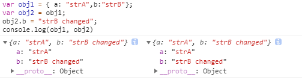
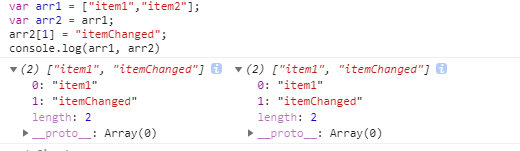
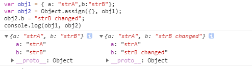
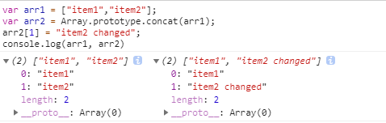
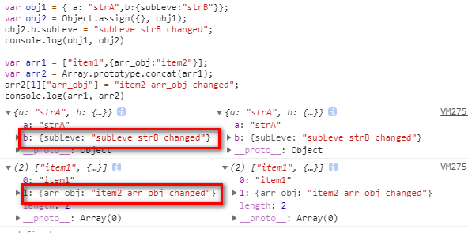
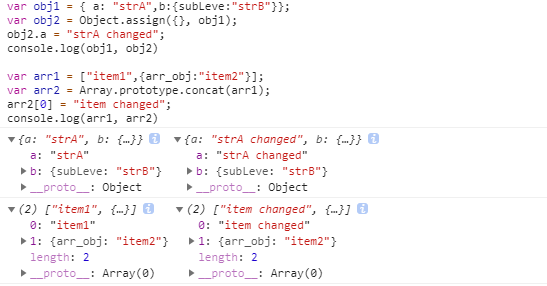
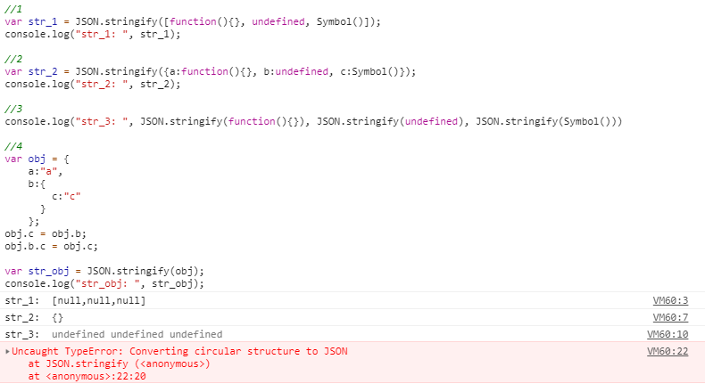
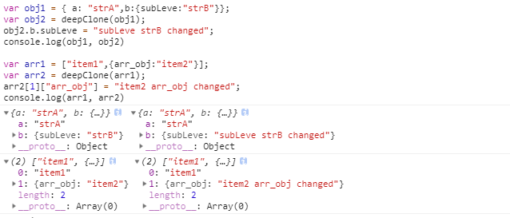

为什么需要浅拷贝或深拷贝？什么时浅拷贝和深拷贝？
谈深浅拷贝之前不得不谈谈数据类型，在 JavaScript 中有分基本类型（null，defined,数字，字符串，布尔值），引用类型（对象）。

基本类型是直接存储在栈( stack )中的数据。
引用类型在栈中保存的是指针，这个指针指向堆中该实体的起始位置。当解释器寻找引用值时，会首先检索其在栈中的地址，取得地址后从堆中获得实体。

有时候我们在实际项目中需要对一个数据进行拷贝，对于基本类型数据我是可以通过复制运算符直接得到一个副本，但是引用类型不行。
随意感受一下：
```
var obj1 = { a: "strA",b:"strB"};
var obj2 = obj1;
obj2.b = "strB changed";
console.log(obj1, obj2)
```

```
var arr1 = ["item1","item2"];
var arr2 = arr1;
arr2[1] = "itemChanged";
console.log(arr1, arr2)
```

原始的那个对象也被修改了，是因为 obj2 , arr2 只是保存了 obj1, arr1 在栈中的指针，这个指针依然是指向堆中原来的那个位置。




这个时候我们就需要开始探索新的真正的拷贝引用类型数据的方法。

### 浅拷贝
#### Object.assign()
Object.assign()接受一个或者多个 Object，从第二个参数开始，将所有的Object 中的属性添加到第一个Object中，如果只有一个参数则直接返回它本身。

```
var obj1 = { a: "strA", b:"strB" };
var obj2 = Object.assign({}, obj1);
obj2.b = "strB changed";
console.log(obj1, obj2)
```


#### Array.prototype.concat(),Array.prototype.slice()
利用 Array 的 slice 和 concat 方法进行浅拷贝的原理就是它们不修改原数组，只会返回一个原数组中的元素的一个新数组。
```
var arr1 = ["item1","item2"];
var arr2 = Array.prototype.concat(arr1);
arr2[1] = "item2 changed";
console.log(arr1, arr2)
```




似乎源头已经不受影响了，然而想象很丰满，显示很骨感，不信的话接着往下看。
```
var obj1 = { a: "strA",b:{subLeve:"strB"}};
var obj2 = Object.assign({}, obj1);
obj2.b.subLeve = "subLeve strB changed";
console.log(obj1, obj2)

var arr1 = ["item1",{arr_obj:"item2"}];
var arr2 = Array.prototype.concat(arr1);
arr2[1]["arr_obj"] = "item2 arr_obj changed";
console.log(arr1, arr2)

```


其中的原因就是，浅拷贝只能对引用类型数据中的基本类型数据进行拷贝，对其中的引用类型数据进行拷贝和将一个引用类型数据赋值是一样的道理。

我们尝试修改一下新浅拷贝的引用类型数据中基本类型：
```
var obj1 = { a: "strA",b:{subLeve:"strB"}};
var obj2 = Object.assign({}, obj1);
obj2.a = "strA changed";
console.log(obj1, obj2)

var arr1 = ["item1",{arr_obj:"item2"}];
var arr2 = Array.prototype.concat(arr1);
arr2[0] = "item changed";
console.log(arr1, arr2)

```


### 深拷贝
### JSON.parse(), JSON.stringify()
原理： JSON.stringify 将引用类型数据转成JSON字符串，再用 JSON.parse() 把字符串解析回来，而且这样引用类型会开辟新的栈，实现深拷贝。
但是它也有缺点。当引用属性中包含函数，undefined，Symbol 数据时会产生不符合预料结果的情况：
1. 当在数组中出现时，它们会被转化成 null;
2. 当在Object中出现时，它们会被忽略掉；
3. 当直接作为参数传入的时候，它们会被转化成 undefined。
4. 不能解决循环引用的对象
```
//1
var str_1 = JSON.stringify([function(){}, undefined, Symbol()]); 
console.log("str_1: ", str_1);

//2
var str_2 = JSON.stringify({a:function(){}, b:undefined, c:Symbol()}); 
console.log("str_2: ", str_2);

//3
console.log("str_3: ", JSON.stringify(function(){}), JSON.stringify(undefined), JSON.stringify(Symbol()))

//4
var obj = {
    a:"a",
    b:{
        c:"c"
      }
    }; 
obj.c = obj.b; 
obj.b.c = obj.c;

var str_obj = JSON.stringify(obj); 
console.log("str_obj: ", str_obj);

```


那么真的深拷贝来了：
```
//深拷贝
function typeChecker(val){
    return Object.prototype.toString.call(val).slice(8,-1);
}

function deepClone(src){
    //null, undefined,number,string,Boolean,Symbol
    if(!src || typeof src !== "object"){
        return src;
    }

    //Date
    if(typeChecker(src) === 'Date'){
        var copy = new Date();
        copy.setTime(src.getTime());
        return copy
    }
    //Array
    if(typeChecker(src) === 'Array'){
        var copy = [];
        for(let i = 0; i < src.length; i++){
            copy[i] = deepClone(src[i])
        }
        return copy;
    }   
    //Object
    if(typeChecker(src) === 'Object'){
        var copy = {};
        for(let i in src){
            if(src.hasOwnProperty(i))copy[i] = deepClone(src[i]);
        }
        return copy;
    }                   
    console.warn("The data can be cloned")
}

```

我们根据不同的数据类型采用不同措施，对于数组和 Object，进行递归调用拷贝函数。
```
var obj1 = { a: "strA",b:{subLeve:"strB"}};
var obj2 = deepClone(obj1);
obj2.b.subLeve = "subLeve strB changed";
console.log(obj1, obj2)

var arr1 = ["item1",{arr_obj:"item2"}];
var arr2 = deepClone(arr1);
arr2[1]["arr_obj"] = "item2 arr_obj changed";
console.log(arr1, arr2)
```

