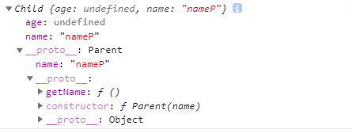
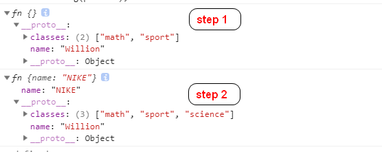
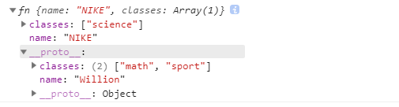
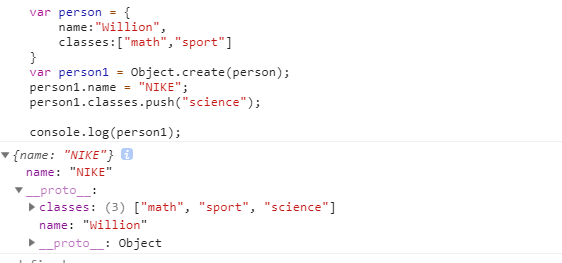
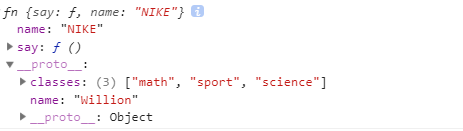
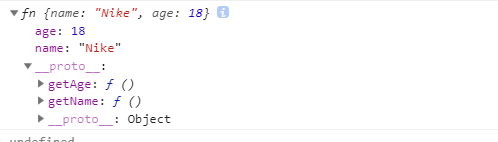
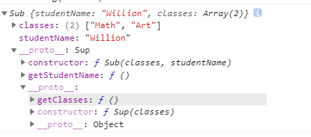

1. 借用构造函数继承
```
	function Parent(name){
		this.name = "nameP";
	}

	Parent.prototype.getName = function(){
		console.log(this.name);
	}
	function Child(age){
		this.age = age;
		Parent.call(this);
	}
	var child = new Child(18);
	console.log(child); // {age: 18, name: "nameP"}
```
借用构造函数继承只能继承构造函数属性,且每一个子类型中都会添加一个副本。


2. 组合继承
```
	function Parent(name){
		this.name = "nameP";
	}

	Parent.prototype.getName = function(){
		console.log(this.name);
	}
	function Child(age){
		this.age = age;
		Parent.call(this);
	}
	Child.prototype = new Parent();

	var child = new Child();
	console.log(child);
```
组合继承需要调用两次父级函数，且父级构造函数属性会被复制两份在子级函数，一份在子级函数的实例上（来自Parent.call(this)），一份在子级函数的原型上（来自Child.prototype = new Parent()）。就被复制两份的属性，只要实例上的属性还在，原型上的就无法被访问到。


3. 原型式继承
原型式继承的结果是复制一个新的副本，但是是浅复制。对引用类型做修改会反映到所有被赋值的对象上。

```
	function clone(obj){
		function fn(){};
		fn.prototype = obj;
		return new fn();
	}
	var person = {
		name:"Willion",
		classes:["math","sport"]
	}

	var person1 = clone(person);
	person1.name = "NIKE";
	person1.classes.push("science");

	var person2 = clone(person);
	person2.name = "John";
	person2.classes.push("art");

	console.log(person.classes);
	console.log(person1.classes);
	console.log(person2.classes);
```
这三个会是同样的结果： ```["math", "sport", "science", "art"]```，其实他们是同一份数组，这份数组被共享了
而且 ```person.classes ==== person1.classes;``` 也为 true.

此时你似乎好奇，明明我在调用了clone()之后修改了name。 为了得到答案我们需要再回看一下clone函数。
```
//...
fn.prototype = obj;
return new fn();
//...
```	
答案就在这两个语句中，obj被赋值给了fn的原型，然后返回了fn的实例。 我们修改的name属性其实就是在往副本的实例上添加属性。修改后我们访问副本的nam属性，你发现已经修改过来，其实并没有修改person中的name属性而是在副本的实例上添加了一个name属性。
我们修改classess的时候，我们修改的就是实例的原型上的的classes。不信的话我们就来打印下修改前后副本的样子。
```
var person1 = clone(person);
//step 1
console.log(person1); 
person1.name = "NIKE";
person1.classes.push("science");	
//step 2
console.log(person1);
```


如果我们给classes重新赋值，其情况和修改name属性是一样的。
```
	var person1 = clone(person);
	person1.name = "NIKE";
	person1.classes = ["science"];

```


原型式继承原理和 ES5 的Object.create()原理一样，Firefox4+, Safari5+, IE9+, Opera12+, Chrome 支持。
```
	var person = {
		name:"Willion",
		classes:["math","sport"]
	}
	var person1 = Object.create(person);
	person1.name = "NIKE";
	person1.classes.push("science");
	
	console.log(person1);
```


4. 寄生式继承（只考虑一个模版被多次继承，不考虑链式继承）

+ 继承基础类型值和Object
```
	var person = {
		name:"Willion",
		classes:["math","sport"]
	}
	function clone(obj){
		function fn(){};
		fn.prototype = obj;
		return new fn();
	}

	function _clone(obj){
		var copy = clone(obj);
		copy.say = function(){
			console.log("Hello world~");
		}
		return copy;
	}

	var person1 = _clone(person);
	person1.name = "NIKE";
	person1.classes.push("science");

	console.log(person1)
```


寄生式继承比原型式继承多的一步就是在副本上添加自定义属性或方法， 原型式继承存在的缺点在寄生式继承上一样的存在。
其实继承基本类型值和引用类型值并不是一个明智的选择。我们应该尽量这样去做。继承函数方法到可以给我们带来很多便利。
就使用寄生式继承，我们对函数方法进行继承，再在副本上添加自定义的属性。

+ 使用寄生式继承继承函数
```
	var person = {
		getName:function(){
			console.log(this.name);
		},
		getAge:function(){
			console.log(this.age)
		}
	}

	function clone(obj){
		function fn(){};
		fn.prototype = obj;
		return new fn();
	}

	function _clone(obj,name){
		var copy = clone(obj);
		copy.name = name;
		return copy;
	}
	var person1 = _clone(person, "Nike");
	console.log(person1)
```



使用寄生式继承来继承函数，可以用于将一个模版复制不同的副本。所有的副本的 ```__proto__``` 都指向了模板。
缺点：
+ 我们需要在继承模版之后才能往副本上定义实例属性。
+ 没有构造属性可以继承。
+ 功能单调，所有的副本来自一个模板，不能实现链式继承

5. 寄生组合式继承
如果我们想同时能够继承构造属性和原型属性一次，且子类函数可以再次被继承，我们就需要结合寄生式继承和组合式继承。

```
function inherit(sup, sub){
	function fn(){};
	 
	//我们使用一个空函数作为继承的中间传递者，空函数没有构造属性，所以不会赋值构造属性到子函数的prototype。
	//sup 和 sub 之间隔了一层 fn，后面对sup 的 prototype的修改，不会影响到 sup 的 prototype
	fn.prototype = sup.prototype;
	sub.prototype = new fn();
	sub.prototype.constructor = sub;
}

function Sup(classes){
	this.classes = classes;
}
Sup.prototype.getClasses = function(){
	console.log(this.classes);
}

function Sub(classes, studentName){
	this.studentName = studentName;
	Sup.call(this,classes);
}
inherit(Sup, Sub);

Sub.prototype.getStudentName = function(){
	console.log(this.studentName);
}

var student = new Sub(["Math", "Art"], "Willion");

console.log(student)
```



到此所有的继承方式都结束完了，大家可以根据自己的需求选择一种继承方式。

