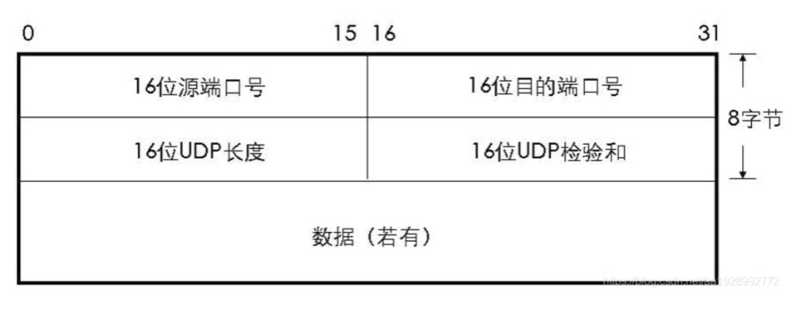

## TCP 和 UDP

### UDP
UDP 常用于一次性传输比较少量数据的网络应用和实时通话等功能。原因如下：

1. UDP 不需要三次握手，不存在建立连接的时延。

2. HTTP 分组中，UDP 首部开销更小。TCP 首部 20 字节，UDP 首部 8 字节。

    常用于一次性传输比较少量数据的网络应用，如DNS等，因为对于这些应用，若是采用 TCP，创建连接会带来不小的开销

3. UDP没有拥塞控制

    应用层能够更好的控制要发送的数据和发送时间，网络中的拥塞也不会影响发送速率。适用于某些实时应用要求数据被稳定地发送，能容忍一些数据的丢失，但是不允许有较大的时延（比如 IP电话，实时视频会议，流媒体等）。

4. UDP 提供尽最大努力的交付，不保证可靠交付。

    没有TCP的确认机制、重传机制。如果因为网络原因没有传送到对端，UDP 也不会给应用层返回错误信息。
    (维护传输可靠性的工作是在应用层来完成)，这也是UDP 适用实时通话等功能的原因。

总结：

UDP 首部开销更小，不需要三次握手，不存在建立连接的时延。常用于一次性传输比较少量数据的网络应用，比如DNS 解析。

UDP 没有拥塞控制；没有TCP的确认机制、重传机制。更好地控制要发送的数据和数据的发送时间，适合实时视频等

### UDP的首部格式

UDP 数据报分为首部和用户数据，UDP数据报文结构如图所示：

UDP首部有 8 个字节，由 4 个字段构成，每个字段都是两个字节:
1. 源端口： 源端口号，需要对方回信时选用，不需要时全部置为 0。
2. 目的端口：目的端口号，在终点交付报文的时候需要用到。
3. 首部和数据部分的长度
4. UDP校验和：检测UDP数据报在传输中是否有错，有错则丢弃。该字段是可选的，当源主机不想计算校验和，则直接令该字段全为0。

当传输层从 IP 层收到UDP数据报时，就根据首部中的目的端口，把 UDP 数据报通过相应的端口，上交给应用进程。

如果接收方 UDP 发现收到的报文中的目的端口号不正确（不存在对应端口号的应用进程0,），就丢弃该报文，并由 ICMP 发送“端口不可达”差错报文给对方。

### TCP 和UDP的区别
协议 | 连接性 | 双工性 | 可靠性 | 头部大小 | 有序性 | 有界性 | 拥塞控制 | 传输速度 | 量级 |
---|---|---|---|---|---|---|---|---|---
TCP | 面向连接(Connection oriented) | 全双工(1:1) | 可靠(重传机制)| 20~60字节 | 有序(通过SYN排序) | 无, 有粘包情况 | 有 | 慢 | 低
UDP | 无连接(Connection less)| n:m | 不可靠(丢包后数据丢失)| 8字节 | 无序 | 有消息边界, 无粘包 | 无| 快| 高

### 常见应用场景
TCP:
* 电子邮件 (SMTP)
* 终端连接 (TELNET)
* 终端连接 (SSH)
* 万维网 (HTTP)
* 文件传输 (FTP)

UDP:
* 域名解析 (DNS)
* 简单文件传输 (TFTP)
* 网络时间校对 (NTP)
* 网络文件系统 (NFS)
* 路由选择 (RIP)
* IP电话
* 流式多媒体通信

PS: 括号内的是应用层协议
