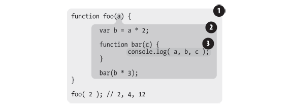

# 为什么说eval()和with影响代码性能

JavaScript采用的是词法作用域，什么是词法作用域呢？
词法作用域是由你在写代码时将变量和块作用域写在哪里来决定的，因此当词法分析器处理代码时会保持作用域
不变（大部分情况下是这样的）。

我们以这段代码作为示例：


```
function foo(a) {
    var b = a * 2;
    function bar(c) {
        console.log( a, b, c );
    }
    bar( b * 3 );
}
foo( 2 ); // 2, 4, 12
```
这段代码的此法作用域如图所示：



在bar函数中，需要对a,b,c 进行RHS查询。
a: 在bar函数中查找, 没有找到；继续向上一级（foo函数）查找，在foo找到了变量a.
b: 在bar函数中查找, 没有找到；继续向上一级（foo函数）查找，在foo找到了变量b.
c: 在bar函数中查找, 在bar找到了变c.

贴上《当JS引擎遇到 var a = 2 发生了些什么？》里面提到的词法作用域建立和标识符查找的过程

1. 编译器首先会将这段程序分解成词法单元 —— 分词/词法分• 析（Tokenizing/Lexing）

2. 将词法单元解析成一个树结构 —— 解析/语法分析（Parsing）

3. 编译器会在当前作用域声明一个变量a（如果有同名称变量存在于同一个作用域的集合中，则忽略这个变量），为引擎生成运行时所需要的代码，这些代码被用来处理a = 2这个赋值操作。

4. 引擎会在作用域中查找该变量，如果能够找到就会对它赋值（如果能在当前作用域找到就直接使用这个变量，如果不能，继续向向上一级作用域查找，直到全局作用域）。


PS:
1. 词法作用域查找只会查找一级标识符，比如a、b 和c。如果代码中引用了foo.bar.baz，
词法作用域查找只会试图查找foo 标识符，找到这个变量后，对象属性访问规则会分别接
管对bar 和baz 属性的访问。


2. 所有变量能被找到的地方（作用域）是在JS引擎编译阶段就形成了的。

### eval
eval(..) 函数可以接受一个一段代码字符串为参数，在运行的时候，eval的参数就像原来已经存在，会对原有的词法作用域的进行修改。在运行eval后面的代码时，引擎是不知道前面的代码是动态插入的。

示例：


```
var b = "b";
function bar (codeStr, a){
    eval(codeStr);
    console.log(a,b); //a codeB
}
bar("var b = 'codeB', "a");
```
在这个示例函数bar中，如果不存在eval，打印结果会是 "a b",执行了eval之后，对现有的bar(...)的词法作用域进行了修改。

PS:
1.eval通常被用来执行动态创建的代码，像示例中这样动态执行的一段固定字符组成的代码，并没有比直接将代码写在那里更好。

2.new Function()的最后一个参数，setTimeout()的第一个参数，可以像eval一样接受一段字符串代码。但尽量避免使用这种写法。

### with

